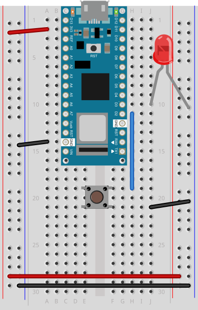
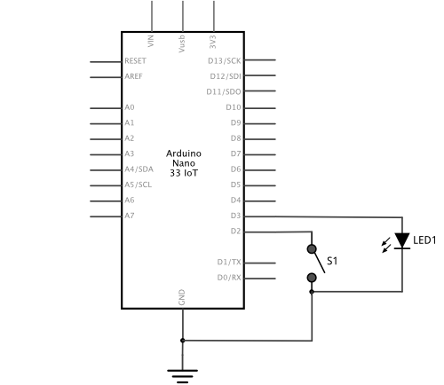

# Arduino Client Example

Here's an example for Arduino in which you can control an LED on someone else's Arduino from a pushbutton on your Arduino. 

## Parts 
To make this work you'll need the following:

* Computer that can run the Arduino IDE
* WiFi-capable Arduino (e.g. Nano 33 IoT, MKR 1010, MKR 1000). These instructions were written for a Nano 33 IoT, but they'll work on any of the boards mentioned here. 
* LED
* Pushbutton
* Breadboard
* USB cable
* Jumper wires

## Circuit
Connect the parts as shown in Figure 1 (breadboard view) and Figure 2 (schematic view). The Nano 33 IoT is mounted at the top of the breadboard, straddling the center divide, with its USB connector facing up. The top pins of the Nano are in row 1 of the breadboard.

<a href="../img/NanoLedPushbutton_bb.png"></a>

 _Figure 1. Arduino Nano connected to an LED and a pushbutton, breadboard view._

<a href="../img/NanoLedPushbutton_schem.png"></a>

 _Figure 2. Arduino Nano connected to an LED and a pushbutton, schematic view._

The Nano, like all Dual-Inline Package (DIP) modules, has its physical pins numbered in a U shape, from top left to bottom left, to bottom right to top right. The Nano’s 3.3V pin (physical pin 2) is connected to the left side red column of the breadboard. The Nano’s GND pin (physical pin 14) is connected to the left side black column.

These columns on the side of a breadboard are commonly called the buses. The red line is the voltage bus, and the black or blue line is the ground bus. The blue columns (ground buses) are connected together at the bottom of the breadboard with a black wire. The red columns (voltage buses) are connected together at the bottom of the breadboard with a red wire.

Physical pin 2 of the Nano (3.3V) is connected to the voltage bus on the left side of the board. Physical pin 14 (ground) is connected to the ground bus. One pin of the pushbutton is conencted to the ground bus. The other pin is connected to digital oin 2 of the Nano (physical pin 20). The LED's anode (long leg) is connected to digital pin 3 of the Nano (physical pin 21). The cathode of the LED (short leg) is connected to the ground bus. 


## Program

1. Download the [Arduino IDE](https://www.arduino.cc/en/Main/Software) if you don't already have it.
1. Install the appropriate board definition for your board 
1. Install the WiFiNINA or WiFi101 library, whichever your board needs.
1. Download this repository
1. Install the ArduinoMqttClient library 
 

### Installing the library and Board Definitions

If you've never used one of the WiFi-capable Arduino boards, you'll need to install the board definition. When you plug the board in, the Arduino IDE should pop up a message asking if you want to install the board definition. If not, click the Tools Menu --> Boards... --> Board Manager, and search for the board you're using. When you find it, click Install.

To install the [ArduinoMqttClient](https://www.arduino.cc/reference/en/libraries/arduinomqttclient/) library, click the Sketch Menu --> Include Library --> Manage Libraries, and search for ArduinoMqttClient. When you find it, click Install. Then do the same for the [WiFiNINA](https://www.arduino.cc/reference/en/libraries/wifinina/) library (if you're using a Nano 33 IoT or MKR 1010) or the [WiFi101](https://www.arduino.cc/reference/en/libraries/wifi101/) library (if you're using a MKR1000).

### Programming the Board

Once you've downloaded this repository, open the [MqttClientButtonLed sketch](https://github.com/tigoe/mqtt-examples/tree/main/MqttClientButtonLed) in the Arduino IDE. Click on the `Arduino_secrets.h` tab (or create it if it's not there), and you'll see the following:

````
#define SECRET_SSID ""
#define SECRET_PASS ""
#define SECRET_MQTT_USER "public"
#define SECRET_MQTT_PASS "public"
````

Fill in your network name and password between the quotes in the `SECRET_SSID` and `SECRET_PASS` lines, and upload the sketch to your Arduino. Once it's uploaded, you're ready to send and receive MQTT messages.

Note: this assumes you're on a network with WPA2 encryption, which is what most people are using at home these days. If you're not, check the [WiFiNINA library documentation](https://www.arduino.cc/reference/en/libraries/wifinina/) for how to configure your sketches for other network types. 

### Send and Receive MQTT Messages

Open the Serial Monitor. If you entered yor network credentials correctly, you should see a message like this:

````
Connecting to linksys
````

If you get **exactly** that message, please change the name of your router to something less obvious. Here are [500 common names to avoid](https://gist.github.com/jgamblin/da795e571fb5f91f9e86a27f2c2f626f). If you get something like "connecting to " followed by your gloriously unique network name, then continue.

Once your Arduino connects, you'll see these messages, one shortly after the other: 

````
Connected. My IP address: 192.168.1.68
connected to broker
````

You're connected, press the button! You should see the LED light up after a fraction of a second, and then fade. In the Serial Monitor, you'll get a message like this (the number will be a random number from 0 to 15):

````
Got a message on topic: lights
13
````

Woo hoo, you're sending messages to yourself!  

If you've got a friend  with an Arduino that's WiFi-enabled, have them follow these steps. When either of you presses the button, both of your LEDs should light up. You're both sending messages through [shiftr.io](https://.shiftr.io/try), an MQTT broker.

If you've used Arduino before, you probably have the basic idea now. and you can modify things from here to get what you want. 

## Send from another client

If you'd like to test this without a friend, there is a p5.js JavaScript example in this repository. called [../p5js-mqtt-client](https://tigoe.github.io/mqtt-examples/p5js-mqtt-client/).  You can try it at [this link](https://tigoe.github.io/mqtt-examples/p5js-mqtt-client/public/index.html). You can also download it and open the index.html file locally. Click the button that appears in the page. A circle in the center of the screen should light up when you click the button, and if your Arduino is connected, the LED should light up too. Similarly, when you press the pushbutton on the Arduino, the circle on the HTML page will light up. Both the HTML page and the Arduino are MQTT clients of the shiftr.io broker.