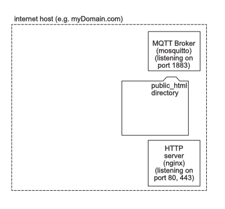
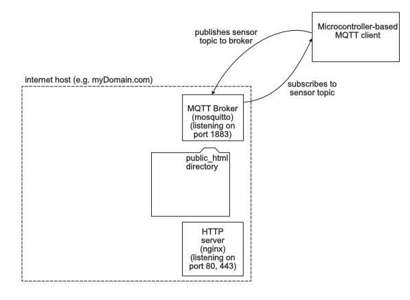
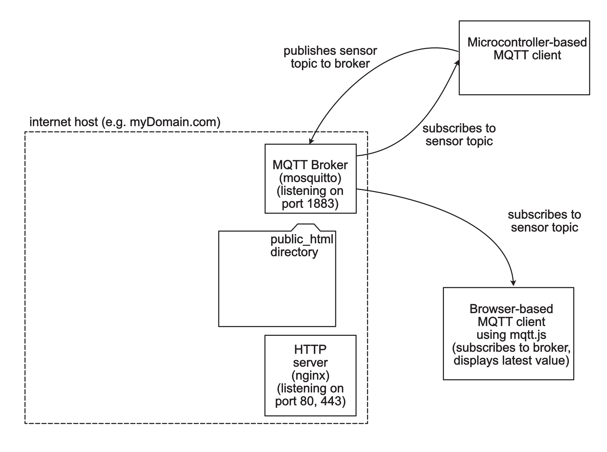
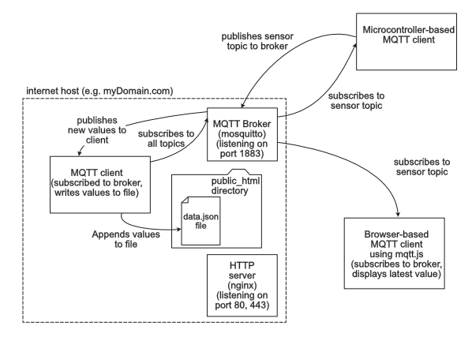
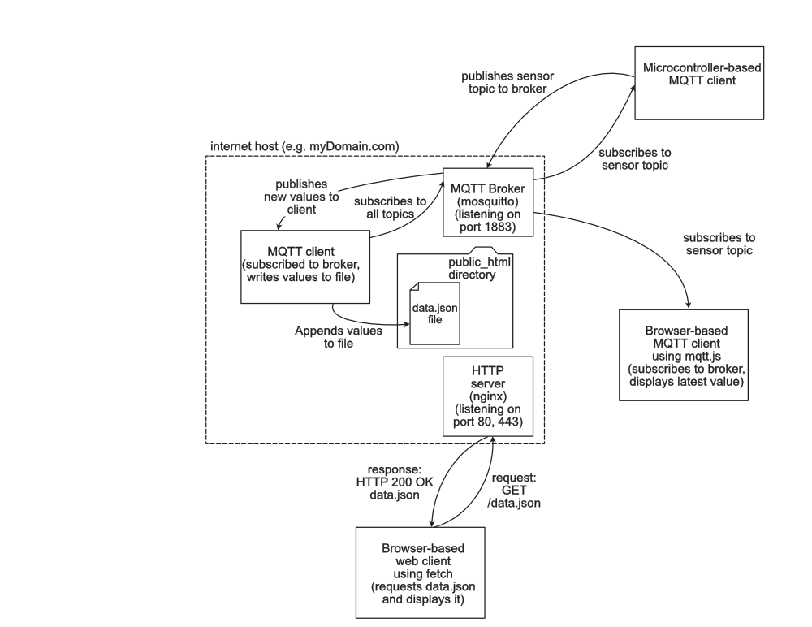
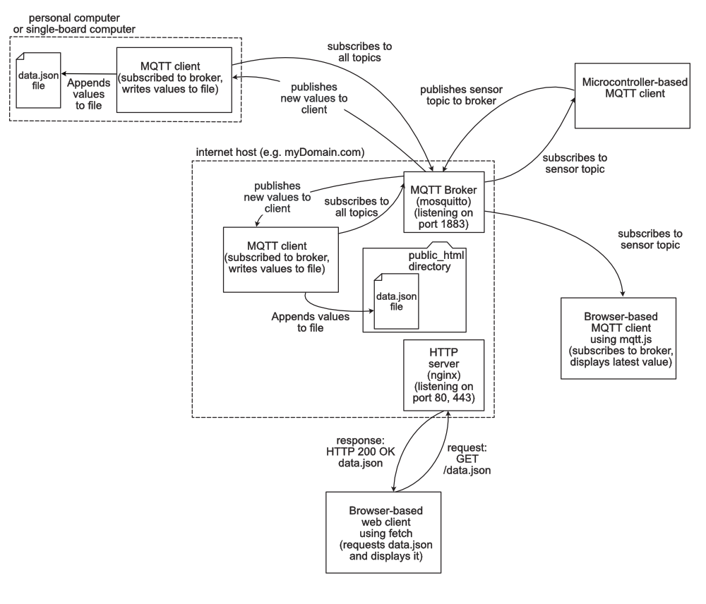

# Anatomy Of An MQTT-Based Datalogging System 

This page describes a typical MQTT-based datalogging system. In this system, microcontroller-based sensor devices publish sensor data in various topics to an MQTT broker like mosquitto on a public host. The host is also running an HTTP server like nginx. Browser-based web apps using a JavaScript-based library like mqtt.js also subscribe to the sensor topics, and display the latest values. A node.js-based MQTT client also subscribes to the sensor topics, and writes the latest values to a file called `data.json` in the public HTML directory of the HTTP server, thus making the history of the data available on the web. 

The core of this system runs an internet host with a public IP address. You can use a hosting service, or you could use a physical device like a personal computer or single-board computer like a Raspberry Pi, as long as the device has a public IP address. That way, your sensor client and your other clients do not have to be on the same local network as the broker.

## Internet Host with HTTP Server and MQTT Broker

The host is running two processes to begin with: an HTTP server program like [nginx](https://nginx.org/en/) or [Apache](https://httpd.apache.org/), and an MQTT broker like [mosquitto](https://mosquitto.org/). The HTTP server is listening on the usual HTTP ports, 80 and 443, and the MQTT broker is listening on the default MQTT port, 1883. As with all HTTP servers, there is a directory on this host where all the public HTML files are served from. This also includes all public images, CSS files, JavaScript files, and any other public files. Figure 1 shows the basics.

*Figure 1. System diagram of an internet host running an MQTT broker and an HTTP Server.*

## Microcontroller-Based MQTT Client 
Next, we'll add a microcontroller-based MQTT client. This client is running on a microcontroller device like an Arduino, and is connecting to the MQTT broker on port 1883. The client is called `sensorClient` and publishes to a topic called `mySensor`. It also subscribes to the topic, so it can see when its values arrive at the broker. The [ArduinoMqttClient](arduino-clients/ArduinoMqttClient) sketch shows example code for this. Figure 2 shows the system so far.

*Figure 2. System diagram of an internet host running an MQTT broker and an HTTP Server, with an MQTT client on a microcontroller.*

## Browser-Based MQTT Client
Next, we'll add a browser-based MQTT client. This client is written in HTML and JavaScript, using an MQTT library like mqtt.js. The client is called `browserClient` and subscribes to the topic called `mySensor`. The [mqtt-client-simple](browser-clients/mqttjs/mqttjs-client-simple) sketch shows example code for this. Figure 3 shows the system so far.

*Figure 3. System diagram of an internet host running an MQTT broker and an HTTP Server, with an MQTT client on a microcontroller and a browseer-based MQTT client.*

The system in Figure 3 works, but there is no part of the system that's saving historical data. The broker is only broadcasting the latest reading on any given topic. In order to save a history of past readings, we need to add another MQTT client that can also save readings to a file or database. 

## Node.js-based MQTT Client for Saving Data
We'll add a client written in node.js using the mqtt.js library. This will run on the same internet host as the broker and the HTTP server. It will subscribe to all the topics by subscribing to `#`, and will save any readings it gets to a file called `data.json`. This file will live in the public HTML directory. That way, anyone can access it through the HTTP server using the url `https://myDomain.com/data.json`. The [MqttNodeClientFileWriter](node-clients/MqttNodeClientFileWriter) shows example code for this client. Figure 4 shows this new addition.

*Figure 4. System diagram of an internet host running an MQTT broker and an HTTP Server, with an MQTT client on a microcontroller and a browseer-based MQTT client. A node.js based MQTT client saves data to the public HTML directory of the HTTP server.*

## Browser-Based Client For Reading Historical Data Using Fetch
Now we have a system that both publishes the latest readings via MQTT, but also publishes the history via HTTP. Any browser-based client can now access the history via HTTP, using the JavaScript fetch library, for example This [fetch example](https://tigoe.github.io/html-for-conndev/fetch/) shows code for this. Figure 5 shows what that would look like:

*Figure 5. System diagram of an internet host running an MQTT broker and an HTTP Server, with several MQTT clients. This builds on Figure 4 by adding a browser-based client to read the history file via HTTP.*

## Saving Data Elsewhere
This system now has options both for sending sensor data, displaying the latest data in a browser, saving the history, and displaying the history. However, the only place you're saving data is on the internet host. If many clients are sending to the broker, that saved history will get large and cumbersome.

### Saving Data in the Browser-Based Client

It would be possible to save historical data in either of the browser-based clients' memories, but this would only last as long as the client is open in a browser. So it's useful for short-term data viewing, but not ideal for longer term. For that, you need a device that can save memory to a file or drive. 

### A Second Host To Save Data
There are other ways to save the data. For example node.js-based MQTT client like the one on the internet host, [MqttNodeClientFileWriter](node-clients/MqttNodeClientFileWriter), might be placed on a separate host, like your personal computer or single-board computer like a Raspberry Pi. Since it is only a client, its host would not need a public IP address. And it could be set up to save  only one or two devices' history, rather than saving everything. Figure 6 shows that variation.

*Figure 6. System diagram of an internet host running an MQTT broker and an HTTP Server, with several MQTT clients. This builds on Figure 5 by adding an external node.js based client to save history on another host.*

### An SD Card To Save Data

It is also possible to save data on the microcontroller-based client, using an SD card reader. [This example](https://itp.nyu.edu/physcomp/labs/labs-serial-communication/lab-data-logging-with-an-sd-card-reader-using-spi-communication/) shows how to write to an SD card from a microcontroller. 

Those are the major variations on how to both access and save data from sensors through a typical MQTT client. What variations you use will depend on your project's particular needs. 