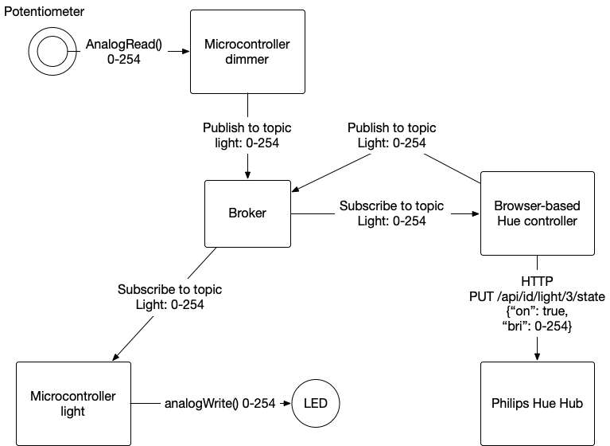

# MQTT vs WebSockets

At first glance, MQTT might look a bit like WebSockets. In both cases, once the connection is established, you can send anything you want between client and server. Traffic is full duplex, meaning that both client and server are listening and speaking at the same time. However, there are some differences. Overall, MQTT is a lighter weight protocol, and is message-based as opposed to session-based.

## WebSockets are Session-Based
The connection process between a WebSocket client and server always begins with a HTTP request from the client that looks like this:

````
HTTP/1.1
GET /websocket
Host:
Upgrade: websocket
Connection: Upgrade
Sec-WebSocket-Key: 
````

The server responds like this:

````
HTTP/1.1 101 Switching Protocols
Upgrade: websocket
Connection: Upgrade
Sec-WebSocket-Accept:
````

Once the initial exchange is done, the client and server establish a socket conection. In OSI terms, this is a [session](https://en.wikipedia.org/wiki/Session_layer), meaning both sides formally opem communications, then maintain information on the state of the connection. The connection is synchronous: once the request is sent, the client has to wait for the server to respond. The server never initiates the connection, it always starts with the client. 

WebSockets were designed as an extension of HTTP, so the session is maintained until one side or the other explicitly closes it. WebSockets work great if you have a client that's native to HTTP (for example, a browser), but if you're making a client on a microcontroller or other memory-limited device, the extra complexity of establishing an HTTP connection to get the WebSocket can be a burden.rm 

## MQTT is Message-Based

MQTT, unlike WebSockets, is message- and topic-based. Client and broker don't establish a session. Instead, they continually exchanges messages. The pattern is called **publish and subscribe**. MQTT host programs are called brokers instead of servers, since they broker traffic between clients. It works like this:

First, the client sends a connection message, and the broker acknowledges it.  

Next, the client either sends a message to a particular topic, or subcribes to a topic. In either case, the broker sends an acknowledgement. 

Messages can be sent at any time. Client or broker do not have to wait for the other besore sending. 

The broker saves the message as the topic's current value, and if other clients subscribe to the same topic, it sends them the value. If another client publishes to the topic, the value is updated, and all clients who've subscribed to the topic are updated with the latest value. 

Client and broker don't maintain a session, they just exchange messages. A broker doesn't save the history of a topic or who sent the latest message, it just maintains the latest message and when it was sent. It's up to the clients to save the history if they need it.  

## One-to-One vs. Many-to-Many

The synchronous, one-way nature of WebSockets makes them great for an ongoing one-to-one relationship between client and server, but it's a problem if you want multiple clients all communicating at the same time.  Similarly, the fact that every exchange starts with an exchange of complex headers makes HTTP and WebSockets a heavier method of exchange than MQTT. MQTT is really designed for a network of sensors that come online from time to time, send an update, and then go back offline. It makes it easy for sensor devices to be ephemeral. WebSockets aren't designed for this kind of on-and-off pattern. They're great if you have a client that needs a dedicated connection to a server for a set period of time, for example a game controller, but it comes at the expense of a stricter, more formal communications protocol.

## Customized Server vs. Generic Broker

There are generally two approaches to using an HTTP server: either you set it up to server static files, and organize all your files in a directory structure, or you write a dynamic server with custom RESTful API endpoints or routes. Either way, clients access your server using a specific set of routes like so: 

````
GET /index.html
GET /images/kitty.jpg
POST /sensor/245
POST /motor/1/speed/100
GET /readings/2020/april
````

The work of managing the information is handled by the server, and by the programmer who sets up the server. Every application demands a custom data structure, and the routes to access that structure. 

MQTT, on the other hand, puts the work on the client. A broker doesn't limit you a particular data model, and it doesn't save any information. If a client needs  a new topic, it just names it and publishes to it. As a result, you seldom need to write a custom MQTT broker program. You can use [any broker](https://tigoe.github.io/mqtt-examples/#mqtt-brokers), and make up all the topics and subtopics you want. Two clients who want to communicate through a broker have to be using the same data model, but the broker doesn't care what it is, it just publishes what you send it. 

For example, let's say you want to control a complex lighting system like the Philips Hue system, and a simple lighting device like an Arduino with an LED attached, both from the same device client through the same broker. The common property that all these clients have is that they want to either receive a light intensity reading, or publish to one. What they do with that reading is up to them.  Figure 1 shows what that might look like via MQTT:



_Figure 1. An MQTT broker  managing the conversation between a microcontroller dimmer, a microcontroller lamp, a browser-based light controller, and a Philips Hue hub. The one thing they have in common, the intensity of light, is the published and subscribed topic._

In this case, as in most MQTT applications, the organizational work is done by the clients, not the broker. The browser-based Hue controller has to translate between MQTT and HTTP, to talk to the Hue hub. The microntroller dimmer has to translate the ADC reading obtained via `analogRead()` into an MQTT publish message. The microcontroller light has to translate the MQTT messages published on the light topic to a PWM signal via `analogWrite()` to control the LED.

The advantage of this is that [any MQTT broker](https://tigoe.github.io/mqtt-examples/#mqtt-brokers) will do the job, and you probably don't have to write your own. You can use one of many existing brokers. It means you have to come up with your own data model, and write clients that can use it, and this part is similar to an HTTP application. The difference is that anything you'd want a server to save has to be written into a client that will store the data published to your topics.